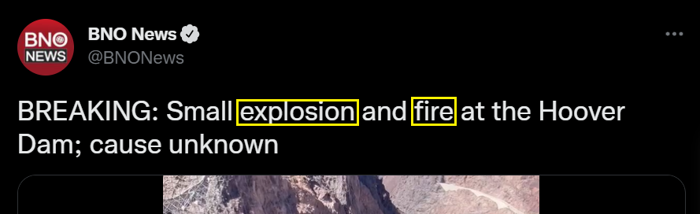
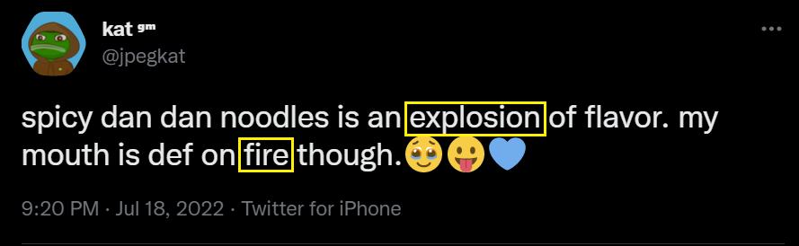
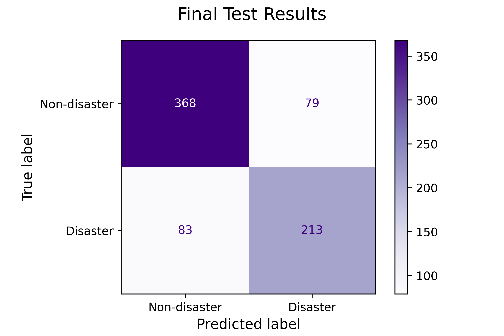

# Tweeting about Disaster
## Using Neural Networks to Detect Tweets About Real Crises

Flatiron School Data Science: Project 4

Advanced Machine Learning Topics
- **Author**: Zaid Shoorbajee
- **Instructor**: Morgan Jones
- **Pace**: Flex, 40 weeks

#### Contents:
* [Business Case](#biz_case)
* [Data Understanding](#data_understanding)
    * [NLP](#nlp)
    * [Dataset](#dataset)
* [Data Analysis & Engineering](#analysis_engineering)
    * [Class distribution](#class_dist)
    * [Tokenization & Lemmatization](#token_lemma)
    * [Tagging (POS & NER)](#pos_ner)
    * [Meta-features](#meta_features)
* [Modeling](#modeling)
    * [Scoring](#scoring)
    * [Architecture](#architecture)
    * [Results](#results)
* [Conclusion](#conclude)
* [References](#references)

## Business Case

An international news outlet, *The Flatiron Post*, wants to be able to report on stories of crises and natural disasters in a prompt manner. News about plane crashes, hurricanes, earthquakes, terrorist threats, and other topics occurs without warning. Being late to the story can mean not only losing to the competition, but also leaving your audience in the dark while speculation runs amok. 

The *Post* wants to tap into Twitter as a resource in order to detect such disasters in real time, and it’s employing a data scientist for the task. Twitter is a fire hose of information; there is a lot more noise than signal, and reporters would waste a lot of time staring at their Twitter feeds just waiting for disaster tweets. But chances are that if a disaster is occurring, someone is tweeting about it. 

The task of the data scientist is to use natural language processing (NLP) and machine learning in order to systematically tell if a tweet is about a real disaster or not. Such tweets can then theoretically be presented to the newsroom in a separate feed. Reporters can then choose to pursue that story or not.
___

## Data Undersanding 

### NLP 

The core type of data being used for this task is the text of tweets. This is **unstructured data** and requires natural language processing (NLP) techniques in order to be interpretable by a machine learning model, such as a neural network.

Working with natural langauge is messy; disaster and non-disaster tweets can use many of the same words, but context changes everything. The following two tweets both have the words "explosion" and "fire" in them. For any literate person, it's obvious which is about a real disaster and which is not.

 
 

For a computer, however, it's not so simple. To make tweets interpretable by a neural network, this project uses the following NLP techniques:

* Tokenization
* Lemmatization
* Removing stop words
* TF-IDF Vectorization
* Part-of-speech tagging
* Named-entity recognition
* Meta-feature extraction
    * Character count, word count, stop word rate, etc.

The idea is that converting tweets into the signals listed above should help a machine learning model to discern the difference between a disaster tweet and non-disaster tweet.

### Dataset 

This project uses the [Natural Language Processing with Disaster Tweets](https://www.kaggle.com/competitions/nlp-getting-started) dataset from Kaggle. This is a dataset recommended by Kaggle for those looking to get started with NLP.

The labeled training set contains **7,613** entries with the following features:
* **id:** Arbitrary identifier
* **keyword:** Search phrase used to collect tweet
* **location:** User-generated location for the tweet's account
* **text:** The text of the tweet
* **target:** Binary label for disaster (1) and non-disaster (0) tweets. Labeled by humans.
___

## Data Analysis & Feature Engineering 

### Class distribution 

The class breakdown of the dataset is as follows:
* **42% class 0 (non-disaster)**
* **58% class 1 (disaster)**

The `keyword` column shows what was used to search for relevant tweets. Realistically, `keyword` isn't a feature that will always be available when trying to predict tweets spotted "in the wild." Furthermore, the client might add or remove keywords from its repertoire of search terms. For these reasons, it is not used as a feature to make predictions.

However, this column can give use insight as to what kinds of tweets the keywords yield. The charts below show keywords with the highest and lowest yields of disaster tweets.

<!-- 
 -->

**We find that there are a lot more keywords on the lower end. This is perhaps a sign that the newsroom should revise the search terms it's using to find these tweets.**

### Tokenization & Lemmatization 

Each tweet was tokenized and lemmatized in order to make stanardized versions of the tweet.

**Example:**
* input: *'shootings explosions hand grenades thrown at cars and houses and vehicles and buildings set on fire. it all just baffles me.is this sweden?'*
* output: *['shooting', 'explosion', 'hand', 'grenade', 'throw', 'at', 'car', 'and', 'house', 'and', 'vehicle', 'and', 'building', 'set', 'on', 'fire', 'it', 'all', 'just', 'baffle', 'i', 'be', 'this', 'sweden']*

When tweets are lemmatized and stop words are removed, the breakdown of the most frequent words in each class looks very different.

**Figure A** shows simply the top *tokens* in common between classes. **Figure B** shows the top *lemmas* in common, excluding stop words.

#### Fig. A

#### Fig. B

There is a stark difference; the lemmatized tweets have much fewer words in common (in the top 20 lists).

The lemmatized tweets were then used to make **term frequency-inverse document frequency (TF-IDF)** vectors, including the **top 500 lemmas** from the entire corpus of tweets, excluding stop words.

### Tagging (POS & NER) 
Other data that I can vectorize includes each tweets' **parts-of-speech** and **named-entities**, such as places, companies, dates, people, and more.

I used SpaCy to make count vectors of these features. Here are some examples of what I used SpaCy to identify for vectorization:

#### Part-of-speech tagging (POS): 
**Example 1:** "*firefighters from connecticut are headed to california to fight wild fires*"

**Example 2:** "*watch this airport get swallowed up by a sandstorm in under a minute*"

#### Named-entity recognition (NER): 
**Example 1:** "*a brief violent storm swept through the chicago area sunday afternoon leading to one death and an evacuation of lollapalooza and more*"

**Example 2:** "*after a suicide bombing in suru that killed people turkey launches airstrikes against isil and kurdistan workers party camps in iraq*"

For the purposes of identifying disaster tweets, here are the [NER tags](https://towardsdatascience.com/explorations-in-named-entity-recognition-and-was-eleanor-roosevelt-right-671271117218) I am interested in:

* **GPE**: Countries, cities, states.
* **LOC**: Non-GPE locations, mountain ranges, bodies of water.
* **NORP**: Nationalities or religious or political groups.
* **ORG**: Companies, agencies, institutions, etc.

### Meta-features 
I was able to engineer more features from each tweet using seemingly arbitrary information from it. Here are the featurs I engineered:
* Did the tweet have a URL
* Character count
* Number of stop words
* Character count of non-stop-words divided by total character count
* Average length of lemmas
* Number of lemmas
* Number of unique lemmas
* Proportion of stop words
* Proportion of words that are hashtags (#)
* Proportion of words that are mentions (@)

**The density plots below show that the distribution of some of these features is clearly different when separated by class.**

### Final dataset

The preprocessed dataset has **537 features**:
* 500 TF-IDF values
* meta-features
* POS vectors
* NER vectors
---

## Modeling 

To make models that can predict if a tweet is in class 0 or 1, I built neural networks using [TensorFlow through the Keras interface](https://www.tensorflow.org/api_docs/python/tf/keras).

The data was split into train, validation, and test sets. The models were trained on the training set and the final model was chosen based on performance on the validation set. The final model was given a score based on its performance on the test set.

I made a simple baseline model and five additional models, experimenting with number layers, number of nodes, L2 regularization, and dropout regularization. The models were configured to run for 150 epochs, but early stopping was implemented if validation loss didn't improve in 20 epochs.

### Scoring and Evaluation: 
I monitored several metrics for each model (loss, accuracy, precision, recall, F1, AUROC).

Ultimately, I'm looking for the model with the best **recall score**. The business case is that a news outlet wants to make sure it doesn't miss important crises that should be reported on. Therefore, it's important to know what level of false negatives the model produces, which recall aptly measures.

>`recall = (true positives) / (false negatives + true positives)`

### Baseline model architecture:
* Input layer: 537 units
* Hidden layer: 268 units
    * Activation: ReLU
* Output layer: 1 unit
    * Activation: Sigmoid
* Optimizer: Stochastic gradient descent
* Loss: Binary crossentropy (log loss)

### Final model architecture (Model 5):
* Input layer: 537 units
* Dropout layer: 20%
* Hidden layer: 134 units
    * Activation: ReLU
    * L2 regularization: 0.05
* Dropout layer: 20%
* Output layer: 1 unit
    * Activation: Sigmoid
* Optimizer: Stochastic gradient descent
* Loss: Binary crossentropy (log loss)

### Results: 
**Several metrics were monitored for each model to make sure there were no red flags.**
#### Validation results 

#### Test results 

* Accuracy: 0.78
* Recall: 0.72
* Precision: 0.73
* F1: 0.69

#### Here's what these results mean about the final model.

* **Accuracy:** The model will correctly classify 78% of all tweets.
* **Recall:** The model will correctly classify 72% of *actual disaster tweets*. The other 28% are false negatives.
* **Precision:** Of all the tweets the model puts in the disaster category, 73% of them will be correct. The other 27% are false positives.

## Conclusion 

### Recommendations
* Discard search terms that don't yield many disaster tweets, such as "harm," "bloody," "screaming," "ruin," etc.
* Reporters should still look at all tweets, but can also be given the model's probability that a tweet is about a disaster.
* 

### Limitations and Future Work

* The training of this model is limited by the tweets provided, as well as the search terms that were used to obtain them. Searching for things like "explosion," "fire," "suicide bomber," etc. seems like it should yield tweets about disasters. But there may be other search terms out there that the person who collected the data overlooked. That may help improve the model's performance.
* The tweets in the provided dataset show if a tweet originally contained a URL, but not if it contained a picture or video. Having that as a feature might have improved the model's performance.
* The purpose of this model is to provide *The Flatiron Post* with a feed-like tool that shows tweets related to disasters and crises. This model is just one piece of the pipeline. Other pieces include a tool that automatically requests tweets through Twitter's API, as well as a user-friendly interface.

### References 
- [Gunes Evitan on Kaggle -- NLP with Disaster Tweets - EDA, Cleaning and BERT](https://www.kaggle.com/code/gunesevitan/nlp-with-disaster-tweets-eda-cleaning-and-bert/notebook)
- [Dataquest: Tutorial -- Text Classification in Python Using spaCy](https://www.dataquest.io/blog/tutorial-text-classification-in-python-using-spacy/)
- [Analytics Vidhya -- A Guide to Feature Engineering in NLP](https://www.analyticsvidhya.com/blog/2021/04/a-guide-to-feature-engineering-in-nlp/)
- [Towards Data Sceince -- Explorations in Named Entity Recognition, and was Eleanor Roosevelt right?](https://towardsdatascience.com/explorations-in-named-entity-recognition-and-was-eleanor-roosevelt-right-671271117218)
- [Capital One -- Understanding TF-IDF for Machine Learning](https://www.capitalone.com/tech/machine-learning/understanding-tf-idf/)
- [Machine Learning Mastery -- Dropout Regularization in Deep Learning Models With Keras](https://machinelearningmastery.com/dropout-regularization-deep-learning-models-keras/)
- [Machine Learning Mastery -- How to use Learning Curves to Diagnose Machine Learning Model Performance](https://machinelearningmastery.com/learning-curves-for-diagnosing-machine-learning-model-performance/)
